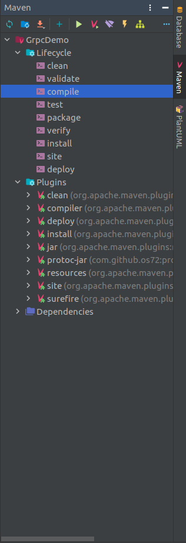
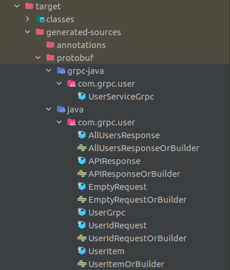
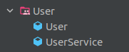
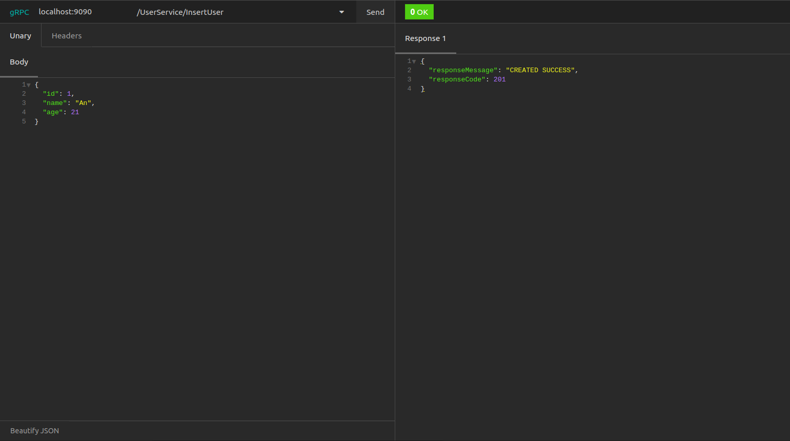
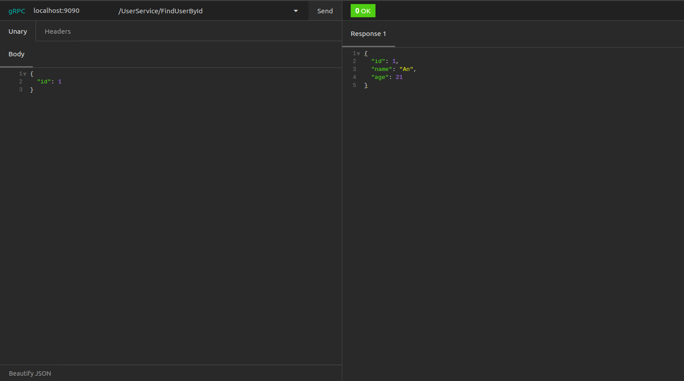

# Implement gRPC service to add, update, delete users

- Create java project with Maven.
- Import dependencies below.

  ```xml
  <dependencies>
    <dependency>
        <groupId>com.google.protobuf</groupId>
        <artifactId>protobuf-java</artifactId>
        <version>3.17.0</version>
    </dependency>

    <dependency>
        <groupId>io.grpc</groupId>
        <artifactId>grpc-netty-shaded</artifactId>
        <version>1.38.0</version>
    </dependency>
    <dependency>
        <groupId>io.grpc</groupId>
        <artifactId>grpc-protobuf</artifactId>
        <version>1.38.0</version>
    </dependency>
    <dependency>
        <groupId>io.grpc</groupId>
        <artifactId>grpc-stub</artifactId>
        <version>1.38.0</version>
    </dependency>

    <dependency> <!-- necessary for Java 9+ -->
        <groupId>org.apache.tomcat</groupId>
        <artifactId>annotations-api</artifactId>
        <version>6.0.53</version>
        <scope>provided</scope>
    </dependency>
  </dependencies>
  ```

  ```xml
  <build>
      <defaultGoal>clean generate-sources compile install</defaultGoal>

      <extensions>
          <extension>
              <groupId>kr.motd.maven</groupId>
              <artifactId>os-maven-plugin</artifactId>
              <version>1.6.2</version>
          </extension>
      </extensions>
      <plugins>
          <plugin>
              <groupId>org.xolstice.maven.plugins</groupId>
              <artifactId>protobuf-maven-plugin</artifactId>
              <version>0.6.1</version>
              <configuration>
                  <protocArtifact>com.google.protobuf:protoc:3.12.0:exe:${os.detected.classifier}</protocArtifact>
                  <pluginId>grpc-java</pluginId>
                  <pluginArtifact>io.grpc:protoc-gen-grpc-java:1.38.0:exe:${os.detected.classifier}</pluginArtifact>
              </configuration>
              <executions>
                  <execution>
                      <goals>
                          <goal>compile</goal>
                          <goal>compile-custom</goal>
                      </goals>
                  </execution>
              </executions>
          </plugin>
      </plugins>
  </build>
  ```

- Create `user.proto` in `./src/main/proto`

  ```protobuf
  syntax = "proto3";

  package com.grpc.user;
  option java_outer_classname = "UserGrpc";
  option java_multiple_files = true;

  service UserService {
    rpc FindAllUsers(EmptyRequest) returns (AllUsersResponse);
    rpc InsertUser(UserItem) returns (APIResponse);
    rpc FindUserById(UserIdRequest) returns (UserItem);
    rpc UpdateUserById(UserItem) returns (APIResponse);
    rpc DeleteUserById(UserIdRequest) returns (APIResponse);
  }

  message APIResponse {
    string responseMessage = 1;
    int32 responseCode = 2;
  }

  message AllUsersResponse {
    repeated UserItem users = 1;
  }

  message UserItem {
    double id = 1;
    string name = 2;
    int32 age = 3;
  }

  message EmptyRequest {
  }

  message UserIdRequest {
    double id = 1;
  }
  ```

- Save file and build with Maven.<br/>
  
- Or you can use command line to generate proto files

  ```maven
  mvn clean install -DskipTests
  ```

- After that, we will have files that protobuf generated for us.<br/>
  

- Create UserService to handle the request relevant to User.<br/>
  

  ```java
    public class User {
      private Long id;
      private String name;
      private int age;

      public User(Long id, String name, int age) {
          this.id = id;
          this.name = name;
          this.age = age;
      }

      public Long getId() {
          return id;
      }

      public void setId(Long id) {
          this.id = id;
      }

      public String getName() {
          return name;
      }

      public void setName(String name) {
          this.name = name;
      }

      public int getAge() {
          return age;
      }

      public void setAge(int age) {
          this.age = age;
      }
    }

    public class UserService extends UserServiceImplBase {
      public static final List<User> users = new ArrayList<>();

      @Override
      public void findAllUsers(EmptyRequest request, StreamObserver<AllUsersResponse> responseObserver) {
          AllUsersResponse.Builder response = AllUsersResponse.newBuilder();

          // Find all users
          for (int i = 0; i < users.size(); i++) {
              UserItem userItem = UserItem.newBuilder()
                      .setId(users.get(i).getId())
                      .setName(users.get(i).getName())
                      .setAge(users.get(i).getAge())
                      .build();
              response.addUsers(i, userItem);
          }

          // Response
          responseObserver.onNext(response.build());
          responseObserver.onCompleted();
      }

      @Override
      public void insertUser(UserItem request, StreamObserver<APIResponse> responseObserver) {
          // Insert user
          User user = new User(
                  (long) request.getId(),
                  request.getName(),
                  request.getAge()
          );
          users.add(user);

          // Response
          APIResponse.Builder response = APIResponse.newBuilder();
          response.setResponseCode(500).setResponseMessage("ADD SUCCESS");

          responseObserver.onNext(response.build());
          responseObserver.onCompleted();
      }

      @Override
      public void findUserById(UserIdRequest request, StreamObserver<UserItem> responseObserver) {
          // Initialize default response
          UserItem.Builder response = UserItem.newBuilder();

          // Find User
          for(User user : users) {
              if(user.getId().equals((long)request.getId())){
                  response
                          .setId(user.getId())
                          .setName(user.getName())
                          .setAge(user.getAge())
                          .build();
              }
          }

          // Response
          responseObserver.onNext(response.build());
          responseObserver.onCompleted();
      }

      @Override
      public void updateUserById(UserItem request, StreamObserver<APIResponse> responseObserver) {
          // Initialize default response
          APIResponse.Builder response = APIResponse.newBuilder();
          response
                  .setResponseCode(400)
                  .setResponseMessage("Can't find user " + request.getId());

          // Find and update User
          for(User user : users) {
              if(user.getId().equals((long)request.getId())) {
                  user.setAge(request.getAge());
                  user.setName(request.getName());

                  response
                          .setResponseCode(500)
                          .setResponseMessage("SUCCESS");
                  break;
              }
          }

          // Response
          responseObserver.onNext(response.build());
          responseObserver.onCompleted();
      }

      @Override
      public void deleteUserById(UserIdRequest request, StreamObserver<APIResponse> responseObserver) {
          // Initialize default response
          APIResponse.Builder response = APIResponse.newBuilder();
          response
                  .setResponseCode(400)
                  .setResponseMessage("Can't find user " + request.getId());

          // Find and remove User
          for(User user : users) {
              if(user.getId().equals((long)request.getId())){
                  users.remove(user);
                  response
                          .setResponseCode(500)
                          .setResponseMessage("SUCCESS");
                  break;
              }
          }

          // Response
          responseObserver.onNext(response.build());
          responseObserver.onCompleted();
      }
    }
  ```

- Create Server to listen request.<br/>
  

  ```java
    public class GRPCServer {
      public static void main(String[] args) throws IOException, InterruptedException {
          Server server = ServerBuilder
                  .forPort(9090)
                  .addService(new UserService())
                  .build();

          server.start();

          System.out.println("Server started at localhost:" + server.getPort());

          server.awaitTermination();
      }
    }
  ```

- Test with Insomnia.<br/>
  <br/>
  
